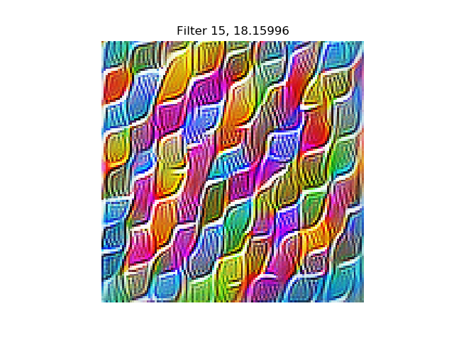
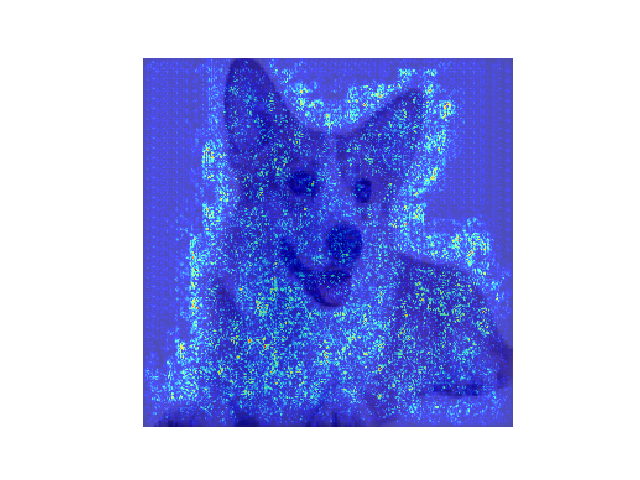

Keras InceptionV3 모델 시각화
===========================
- feature visualization => lucid<br/>
- saliency => kears-vis<br/>
사용

Dependencies
------------
- tensorflow
- keras
- keras-vis
- lucid
- matplotlib
- numpy

How to Use
------
example
```
$python visualize.py
-modelzoo_file="keras_inception_v3_frozen.pb.modelzoo"
-conv_layer_idx=6
-filter_idx=15
-num_of_filters=1
-input_image_path="image/welshcorgi.jpg"
```

Output
------
feature_visualization 결과 (conv2d_6 15th filter) <br/>
  <br/>


saliency_visualization 결과 (conv2d_6 15th filter saliency)  <br/>
  <br/>

option 별 설명
--------------
-modelzoo_file:
freeze_graph.py의 output_graph로 나온 .modelzoo 파일
([lucid model import](https://colab.research.google.com/drive/1PPzeZi5sBN2YRlBmKsdvZPbfYtZI-pHl) 참고)

-conv_layer_idx:
Keras InceptionV3 모델에서 시각화 하고 싶은 conv2d layer 번호 (1~94)

-filter_idx:
시각화 하고 싶은 filter 번호 (optional)

-num_of_filters:
filter_idx가 주어질 경우 1, filter_idx를 특정하지 않을 경우 한 layer에서 시각화하고 싶은 filter 갯수

-input_image_path:
saliency를 시각화 하고 싶은 이미지
